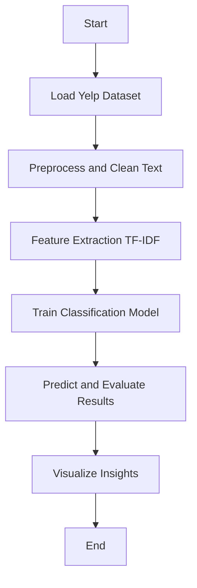

# 📝 ML-project8-Yelp-Reviews


A machine learning project for classifying Yelp reviews using NLP and supervised learning algorithms.

---

## ⭐ Project Overview

This repository demonstrates how to build a review classification system for Yelp data, using natural language processing (NLP) and machine learning. The project covers data preprocessing, feature extraction, model training, and evaluation.

---

## 📁 Repository Contents

| File/Folder                              | Description                                |
|------------------------------------------|--------------------------------------------|
| `Project 7 - Yelp Reviews Classification.ipynb` | Jupyter Notebook with code and explanations |
| `Project 7 - Yelp Reviews.pptx`          | Project presentation slides                |
| `yelp.csv`                               | Yelp reviews dataset                       |
| `LICENSE`                                | License information                        |
| `README.md`                              | This file                                  |

---

## ⚙️ Workflow Flowchart



## 🚀 Quick Start

1. **Clone the repository:**
   ```bash
   git clone https://github.com/mdzaheerjk/ML-project8-Yelp-Reviews.git
   ```

2. **Open the Jupyter Notebook:**
   - Make sure Python and Jupyter are installed.
   - Launch `Project 7 - Yelp Reviews Classification.ipynb`.

3. **Run the notebook:**
   - Follow the step-by-step instructions.
   - Explore data preprocessing, model building, and result visualization.

---

## 🧰 Requirements

- 
- 
- 
- 
- 
- 

Install dependencies with:
```bash
pip install pandas numpy matplotlib seaborn scikit-learn notebook
```

---

## 🏆 Results & Insights

- Accurate classification of Yelp reviews (positive/negative or multi-class).
- Visual insights into text features and model performance.

---

## 📄 License

This project is licensed under the [MIT License](LICENSE).

---

## 👤 Author

**mdzaheerjk**

---
